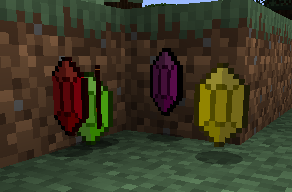

# The Legend of Hyrule

A minecraft mod based on the Legend of Zelda 3D game series. Several years ago I wanted to make a Zelda mod however I lost all of my progress, so I decided to try again with my new programming skills. The four games this mod is based on is Ocarina of Time, Majora's Mask, The Wind Waker and Twilight Princess.

### Is this mod available?

Not yet, I would like to make sure it has sufficient content before actually releasing it, but feel free to download the source and compile it if you don't want to wait.

### What are you planning on adding?

I am planning on adding all of the items found in the four games I mentioned above. Afterwards I will focus on making menus, enemies, the main NPCs and possibly new dimensions.

### Where will I find information about this mod?

I am planning on creating a small wiki for all of the content I add.